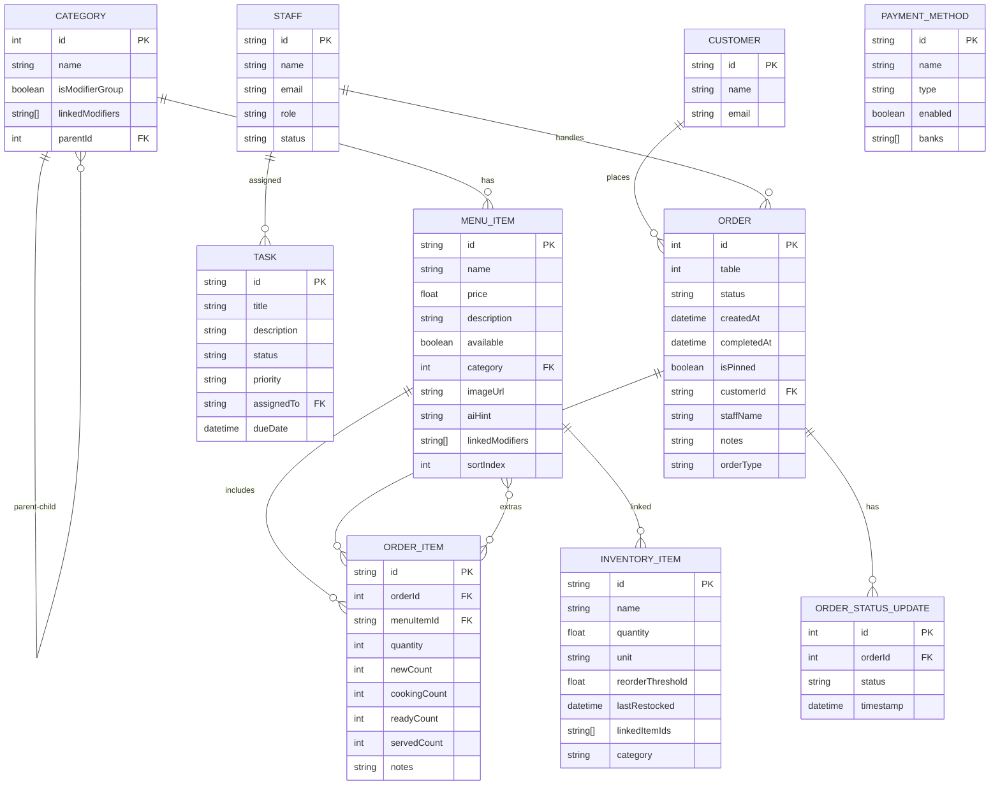

# Chefcito Database Relationship Diagram

```mermaid
erDiagram
    %% Entities
    CATEGORY {
        int id PK
        string name
        boolean isModifierGroup
        string[] linkedModifiers
        int parentId FK
    }
    
    MENU_ITEM {
        string id PK
        string name
        float price
        string description
        boolean available
        int category FK
        string imageUrl
        string aiHint
        string[] linkedModifiers
        int sortIndex
    }
    
    ORDER {
        int id PK
        int table
        string status
        datetime createdAt
        datetime completedAt
        boolean isPinned
        string customerId FK
        string staffName
        string notes
        string orderType
    }
    
    ORDER_ITEM {
        string id PK
        int orderId FK
        string menuItemId FK
        int quantity
        int newCount
        int cookingCount
        int readyCount
        int servedCount
        string notes
    }
    
    ORDER_STATUS_UPDATE {
        int id PK
        int orderId FK
        string status
        datetime timestamp
    }
    
    CUSTOMER {
        string id PK
        string name
        string email
    }
    
    STAFF {
        string id PK
        string name
        string email
        string role
        string status
    }
    
    INVENTORY_ITEM {
        string id PK
        string name
        float quantity
        string unit
        float reorderThreshold
        datetime lastRestocked
        string[] linkedItemIds
        string category
    }
    
    PAYMENT_METHOD {
        string id PK
        string name
        string type
        boolean enabled
        string[] banks
    }
    
    TASK {
        string id PK
        string title
        string description
        string status
        string priority
        string assignedTo FK
        datetime dueDate
    }
    
    %% Relationships
    CATEGORY ||--o{ CATEGORY : "parent-child"
    CATEGORY ||--o{ MENU_ITEM : "has"
    MENU_ITEM ||--o{ ORDER_ITEM : "includes"
    ORDER ||--o{ ORDER_ITEM : "contains"
    ORDER ||--o{ ORDER_STATUS_UPDATE : "has"
    CUSTOMER ||--o{ ORDER : "places"
    STAFF ||--o{ ORDER : "handles"
    STAFF ||--o{ TASK : "assigned"
    MENU_ITEM ||--o{ INVENTORY_ITEM : "linked"
    ORDER_ITEM }o--o{ MENU_ITEM : "extras"
```