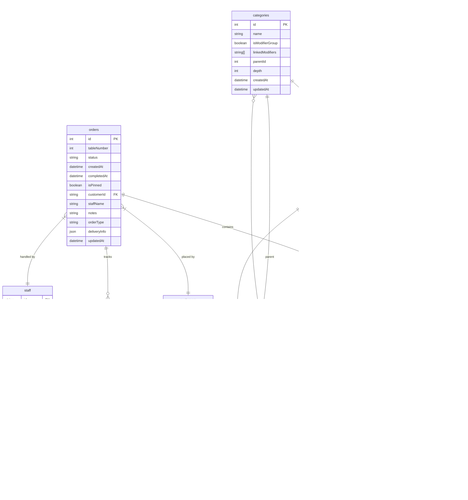

# Database Schema

```mermaid
erDiagram
    %% Entities
    categories {
        int id PK
        string name
        boolean isModifierGroup
        string[] linkedModifiers
        int parentId
        int depth
        datetime createdAt
        datetime updatedAt
    }
    
    menu_items {
        string id PK
        string name
        float price
        string description
        boolean available
        string category
        string imageUrl
        string aiHint
        string[] linkedModifiers
        int sortIndex
        datetime createdAt
        datetime updatedAt
    }
    
    orders {
        int id PK
        int tableNumber
        string status
        datetime createdAt
        datetime completedAt
        boolean isPinned
        string customerId FK
        string staffName
        string notes
        string orderType
        json deliveryInfo
        datetime updatedAt
    }
    
    order_items {
        string id PK
        int orderId FK
        string menuItemId FK
        int quantity
        int newCount
        int cookingCount
        int readyCount
        int servedCount
        string notes
        datetime createdAt
        datetime updatedAt
    }
    
    order_item_extras {
        int id PK
        string orderItemId FK
        string extraMenuItemId FK
    }
    
    order_status_history {
        int id PK
        int orderId FK
        string status
        datetime timestamp
    }
    
    customers {
        string id PK
        string name
        string email
        datetime createdAt
        datetime updatedAt
    }
    
    staff {
        string id PK
        string name
        string email
        string role
        string status
        datetime createdAt
        datetime updatedAt
    }
    
    payment_methods {
        string id PK
        string name
        string type
        boolean enabled
        string[] banks
        datetime createdAt
        datetime updatedAt
    }
    
    inventory_items {
        string id PK
        string name
        float quantity
        string unit
        float reorderThreshold
        datetime lastRestocked
        string[] linkedItemIds
        string category
        datetime createdAt
        datetime updatedAt
    }
    
    tasks {
        string id PK
        string title
        string description
        string status
        string priority
        string assignedTo FK
        datetime dueDate
        datetime createdAt
        datetime updatedAt
    }
    
    %% Relationships
    categories ||--o{ categories : "parent"
    categories ||--o{ menu_items : "contains"
    menu_items ||--o{ order_items : "ordered as"
    menu_items ||--o{ order_item_extras : "as extra"
    orders ||--o{ order_items : "contains"
    orders ||--o{ order_status_history : "tracks"
    orders }|--|| customers : "placed by"
    orders }|--|| staff : "handled by"
    order_items ||--o{ order_item_extras : "has extras"
    order_items }|--|| menu_items : "references"
    order_item_extras }|--|| menu_items : "extra item"
    staff ||--o{ tasks : "assigned"
```

## API Documentation

For detailed information about the API endpoints, please refer to the [API Documentation](./api.md) file.